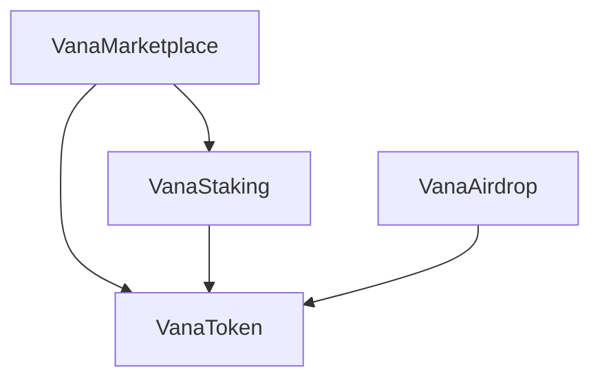

# Vana NFT Marketplace Technical Documentation

## Architecture

The Vana NFT Marketplace consists of four main contracts:

1. **VanaToken**: ERC20 token for marketplace transactions
2. **VanaMarketplace**: Core marketplace functionality
3. **VanaStaking**: NFT staking and rewards
4. **VanaAirdrop**: Token distribution system

### Contract Interactions



## Security Features

### Access Control

- Role-based access control for admin functions
- Ownership management for critical operations
- Whitelist system for collections

### Economic Security

- Fee limits and validations
- Price range enforcement
- Royalty distribution system

### Technical Security

- Reentrancy protection
- Integer overflow prevention
- Pausable functionality
- Emergency withdrawal mechanisms

## Gas Optimizations

1. **Storage Optimizations**

   - Struct packing
   - Efficient mapping usage
   - Minimal storage operations

2. **Computation Optimizations**
   - Unchecked arithmetic where safe
   - Short-circuit evaluations
   - Batch operations support

## Upgrade Mechanism

The contracts use the OpenZeppelin UUPS proxy pattern for upgradeability:

1. Implementation contracts are deployed
2. Proxy contracts are deployed
3. Implementation addresses are registered
4. Ownership is transferred to governance

## Testing

```bash
# Run all tests
npm test

# Run specific test suite
npm test test/VanaMarketplace.test.ts

# Run coverage report
npm run coverage
```

## Deployment

```bash
# Deploy to testnet
npm run deploy:testnet

# Deploy to mainnet
npm run deploy:mainnet

# Verify contracts
npm run verify
```
